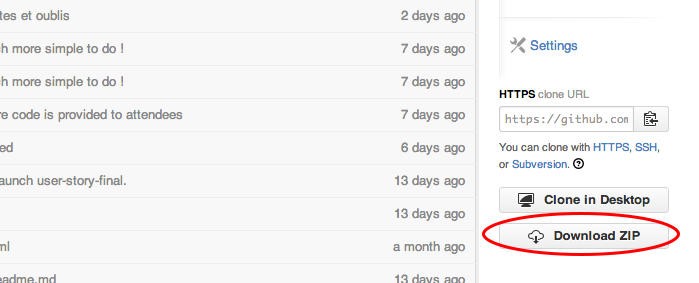
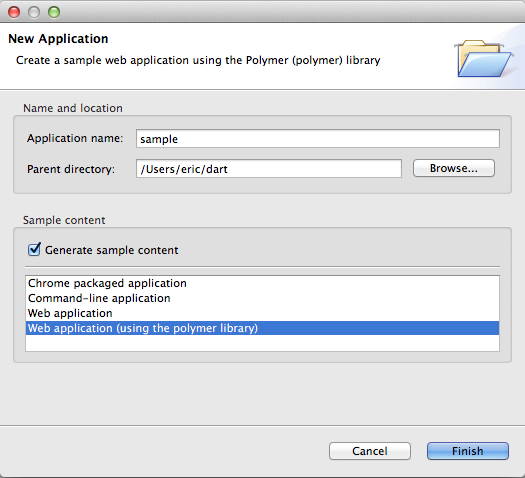
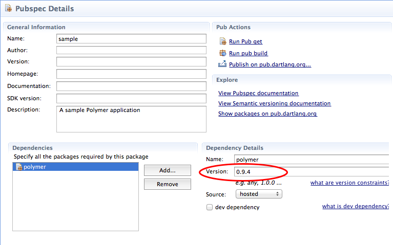
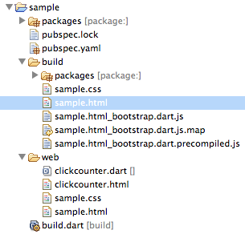

**The following explanations are in French. We had expected to translate this codelab in English but unfortunately we haven't had enough time. If you speak French and want to help us translate, you are really welcome :**  
- fork this project  
- copy each `user-story-x.md` to `user-story-X-<locale>` (where locale is `en`, or whatever you want)  
- translate  
- send push request 
  
# Movie-Board

Cette application Dart a été créée à l'occasion de l'évènement mondial [Dart Flight School](https://www.dartlang.org/events/2014/flight-school/) au [Montpellier JUG](http://www.jug-montpellier.org).  

Vous pouvez tester le [résultat final](http://eric-taix.github.io/movie-board/) de l'application.

# Introduction

Le but est de développer une application gérant des films. Les utilisateurs seront capables :  
-  d'afficher les informations d'un film  
-  d'afficher les films par catégorie (tous, films en salle, films bientôt sur les écrans)  
-  de trier les films par vote moyen, nom, favori  
-  d'effectuer une recherche sur le titre du film  
-  d'ajouter / supprimer des films à leurs favoris  
-  de stocker leurs films favoris dans les données du navigateur  

### Données des films
Les données des films proviennent de [The Movie DataBase](http://www.themoviedb.org/).
  
Ces données ont déjà été récupérées et ne nécessitent donc pas de créer un compte sur TMDB.org : ce codelab est donc complètement autonome et une connexion internet n'est pas obligatoire (même si celle-ci est préférable pour consulter les documentations en ligne de DartLang).

### Que pouvez-vous espérer ?

Ce codelab n'est pas un remplacement aux informations du site web Dartlang : après ce codelab, nous vous conseillons de visiter [le site web DartLang](https://www.dartlang.org/) et d'essayer les autres exemples, tutoriels, etc. Il existe aussi de nombreux autres sites web, groupes d'utilisateurs et blogs qui vous permettent de découvrir la plateforme Dart.  
  
En voici quelques-uns non exhaustifs :  
- [Dartisans : Communauté Google+ Dart](https://plus.google.com/u/0/communities/114566943291919232850)  
- [DartLangFr : Communauté Google+ en francais](https://plus.google.com/u/0/communities/104813951711720144450)  
- [Game Store Codelab : un autre codelab réalisé par DartLangFr](https://github.com/dartlangfr/game-store-codelab)  
- [ng-darrrt-codelab : un portage du codelab darrrt avec Angular.dart par DartLangFr](https://github.com/dartlangfr/ng-darrrt-codelab)  
- [Blog de Seth Ladd : developer advocate chez Google](http://blog.sethladd.com/)

  
Qu'allez-vous apprendre dans ce codelab ?
  
*   Comment écrire un Web-Component avec Polymer  
*   Comment est organisé une application Dart  
*   Comment décoder un flux JSON    
*   Comment utiliser les Fufure    
*   Comment écrire du code fonctionnel    
*   Comment utiliser le localstorage du navigateur  
  
Qu'est-ce que vous n'apprendrez pas ?  
  
*   A écrire du code HTML    
*   A écrire du code CSS  
*   La programmation orienté objet

*Ces derniers éléments doivent déjà être connus pour participer sereinement à ce codelab.*  

  
  
### Liens utiles
- [A Tour of the Dart Language][2]
- [Dart API Reference][3]
- [Polymer.dart][4]
- [Polymer.dart examples][5]
  
  
#Préparation  
**Avant de participer au codelab, veuillez préparer les points suivants :**  

  
* Téléchargez et installez [Dart-Editor](http://www.dartlang.org) (Ce codelab a été testé avec la version v1.1.1)   
 
* Installez un navigateur récent sur votre PC portable (ce codelab a été testé avec Chrome 32.0, Firefox 26.0, Safari 6.1)  
  
* Téléchargez ensuite le projet en cliquant sur le bouton `Download ZIP` :  
  
*Vous pouvez aussi cloner le projet si vous connaissez Git.*  

* Décompressez l'archive sur votre PC portable. **N'ouvrez pas le projet avant le jour du codelab !**  

* Lancez Dart Editor et créez une nouvelle application `sample` en cliquant sur `File - New application` et en sélectionnant `web application (using the polymer application)` et en sélectionnant l'option `Generate sample content` :  
  
  
* Ouvrez le fichier `pubspec.yaml` et modifiez la version de polymer en remplaçant `any` par `0.9.4`  :
    
  
* Sauvegardez le fichier `pubspec.yaml`
  
  > ** Notes :**  
  > Cette manipulation vise seulement à :  
  > - Etre sûr que nous utilisions tous la même version de Polymer pendant le codelab  
  > - Télécharger le package `Polymer` et ses dépendances avant votre venue au codelab  

* Effectuez un clic-droit sur le fichier `sample.html` puis cliquez sur `Run in Dartium`. Vérifiez le bon fonctionnement de l'application : en cliquant sur le bouton `Click me`, le compteur s'incrémente

* Effectuez enfin un clic-droit sur le fichier `sample.html` puis cliquez sur `Build Polymer App`

* Après quelques secondes, le répertoire `build` est créé :  
  

* Effectuez un clic-droit sur le fichier `build/sample.html` puis cliquez sur `Run as Javascript`. Vérifiez à nouveau le comportement de l'application dans votre navigateur.

Si vous avez réussi à passer toutes ces étapes avec succès, vous êtes prêt pour assister au codelab.  Si au contraire vous avez du mal à passer ces différentes étapes, n'hésitez pas à vous rapprocher des organisateurs du codelab.

**Important : n'ouvrez pas le projet `movie-board` et ne consultez pas les user-stories avant le codelab !**  
  
# User stories
Ce codelab est divisé en 4 parties :

1. [Afficher les données d'un film (titre, poster, date de sortie)](docs/user-story-1-1.md)
2. [Afficher l'ensemble des films](docs/user-story-2-1.md)
3. [Effectuer des filtres et des tris sur les films](docs/user-story-3-1.md)
4. [Gérer les favoris et les catégories de films](docs/user-story-4-1.md)

Chaque partie est prévue pour durer 30 minutes.  
  
Le temps étant variable en fonction de votre expérience, nous avons prévu pour chaque partie un ou plusieurs bonus. Ces bonus sont optionnels et ne sont à réaliser que si vous êtes en avance sur le temps prévu.

Le projet contient plusieurs répertoires nommés `user-story-X` où `X` correspond au numéro de l'histoire. Chacun de ces répertoires contient le code auquel vous auriez pu arriver à la fin de l'histoire `X`. Dans le cas où vous seriez perdu ou trop en retard, n'hésitez pas à laisser votre code actuel de côté et travaillez directement dans l'un de ces répertoires.

Le répertoire `user-story-final` contient le code final de l'application. Cette application contient des fonctionnalités que vous ne verrez pas dans les 4 parties énoncées précédemment et le code peut varier par rapport à celui que vous avez réalisé (notamment parce que nous avions prévu plus d'activités à l'origine et que nous avons dû en modifier ou en supprimer certaines afin de ne pas dépasser la durée maximale du codelab). 
  
# Templates et styles
Ce codelab étant prévu pour une durée de 2 heures, le code est largement fourni durant tout le codelab. Seuls les bonus vous demandent un peu plus d'effort sur l'écriture du code. Le copier/coller des templates ne nous semble pas forcément une bonne solution pour apprendre mais vous êtes libre de faire ce que bon vous semble.  

Cette fourniture de code est notamment valable pour le code HTML ainsi que pour les styles CSS.  
**Ne modifiez pas le code HTML, ni les styles utilisés** : même si cela pourrait être largement amélioré, ce codelab n'a pas pour but d'apprendre le HTML et ni le CSS. De plus le code actuel fonctionne ;-)

# Prêt ?
Vous êtes prêt à démarrer le codelab. Cela se passe ici : [Afficher les données d'un film (titre, poster, date de sortie)](docs/user-story-1-1.md).
  
# Credits

[+Eric Taix](https://plus.google.com/u/0/+EricTaix)  

La réalisation de ce codelab est un énorme travail qui n'a été possible que grâce à un travail collectif important.  
Je remercie donc vivement les personnes suivantes qui ont su donner de leur temps :  
 - Arnaud Castelltort  
 - Stéphane Rémillieux  
 - Olivier Nouguier  
 - Christophe Mourette  
Et notamment les étudiants de 4ème année de Polytech Montpellier :   
 - Alaric Calmette  
 - Benoît Ruiz ([+Benoît Ruiz](https://plus.google.com/u/0/+BenoîtRuiz))
 - Kevin Langles  
 - Kevin Yot   
 - Victor Hiairrassary   
 
Un remerciement aussi à [+Nicolas François](https://plus.google.com/+NicolasFrancois) et à [+Guillaume Girou](https://plus.google.com/+GuillaumeGirou). Je me suis largement inspiré de leur codelab [Game Store Codelab](https://github.com/dartlangfr/game-store-codelab).  
  
  
[1]: https://www.dartlang.org/
[2]: https://www.dartlang.org/docs/dart-up-and-running/contents/ch02.html
[3]: http://api.dartlang.org/docs/channels/stable/latest/
[4]: https://www.dartlang.org/polymer-dart/
[5]: https://github.com/sethladd/dart-polymer-dart-examples/tree/master/web
