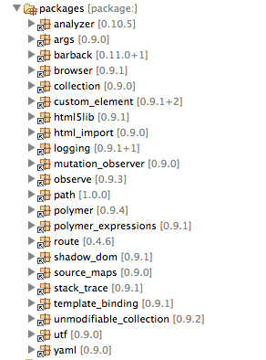

## 1. Afficher les données d'un film (titre, poster, date de sortie)
> **Objectifs :**   
> - _Comprendre la structure principale d'un projet Dart  
> - Apprendre à créer un composant web avec Polymer  
> - Effectuer le binding sur un objet métier
> - Utiliser Polymer Expressions et les filtres
> - Créer sa 1ère closure en Dart_  
  
    

###Premiers pas...###

1. Commencez par lancer Dart Editor et ouvrez le répertoire `movie-board` (dans lequel vous avez décompressé l'archive) et explorez la structure du projet (ces éléments sont les éléments standards que vous retrouverez lorsque vous créez une nouvelle application Polymer en partant d'un exemple):

     
  
  - Ouvrez le fichier `pubspec.yaml`: il contient les dépendances du projet ainsi que des indications sur comment compiler celui-ci

  ```
   dependencies:  
        polymer: any  
      transformers:  
        - polymer:
          entry_points: web/movie_board.html
  ```
> **Conseil** Si vous souhaitez renommer votre point d'entrée `movie_board.html` en `index.html` par exemple, pensez bien à modifier votre fichier `pubspec.yaml` afin de modifier la valeur de `entry_points` sinon `dart2js` ne sera pas capable de compiler votre code Dart en Javascript.       
    
  - `build.dart` est le script Dart qui est lancé après une sauvegarde et permet d'afficher les warning dans l'éditeur
    
  - `clickcounter.html` et `clickcounter.dart` représente un composant personnalisé nommé `click-counter`. Ouvrez ces 2 fichiers.  
      _Nous ne nous servirons pas de ces fichiers mais gardez les à titre d'exemple !_
  
      ```
      <polymer-element name="click-counter" attributes="count"> (1)
        <template>
          <!-- Custom element body -->
        </template>
        <script type="application/dart" src="clickcounter.dart"></script>
      </polymer-element>
      ```
  
      ```
      import 'package:polymer/polymer.dart';
      @CustomTag('click-counter') (1)
      class ClickCounter extends PolymerElement {
        ClickCounter.created() : super.created();
      }
      ```
	  
  `clickcounter.html` importe `clickcounter.dart` (à travers le tag script) et ces 2 fichiers forment le composant car ils partagent le même nom : `click-counter` (1)
  
> **Note:** Le nom d'un composant doit toujours être composé de 2 mots séparés par un tiret : `xxx-yyy`  
  
  - `movie_board.html` importe le composant `click-counter` (1) afin de pouvoir l'utiliser et initialise Dart (2) et Polymer (3)    

  
      ```
      <head>
        <link rel="import" href="clickcounter.html"> (1)
        <script type="application/dart">export 'package:polymer/init.dart';</script> (3)
        <script src="packages/browser/dart.js"></script> (2)
      </head>
      <body>   
        <click-counter count="5"></click-counter>
      </body>
      ```
  - Effectuez un clic-droit sur `movie_board.html` et sélectionnez `Run in Dartium`et testez l'application  
  
  - Le répertoire `packages`contient les packages Dart que vous utilisez dans votre projet.  
  
      
  
  - Les autres répertoires (user-story-X, common, docs) sont des répertoires dédiés à faciliter codelab .  
  **ATTENTION :** Votre répertoire de travail est `web`. Ne regardez pas le contenu des répertoires `user-story-xxx` !!!
  
> **Astuce :** Sachez que si vous êtes perdu, vous pouvez toujours repartir d'un des répertoires `user-story-X`. Ces répertoires contiennent le résultat typique que vous devez obtenir à la fin de chaque user story.  
  
  
###Votre 1er composant...###

**Votre répertoire de travail est `web`, sauf si vous décidez de repartir d'une user-story finalisée. Dans ce cas travaillez directement dans le répertoire adéquate.**

1. Créez un nouveau composant nommé `movie-poster` 
   - Créez le fichier `poster.html` avec le contenu suivant:  
   
   ```
   <polymer-element name="movie-poster">
  	 <template>
    	<li class="movie">
      		<span class="favorite">V</span>
      		<section class="overlay"> 
        		<h2>Dart Flight School - Montpellier JUG</h2> 
        		<div>Release date: 2014/02/19</div>
        		<div>Rating: <span class="rating">XXXXXXXXX</span><span>X</span></div>
        		<div>Voters : 80</div>
        		<div class="comment">Well done guys !</div>
      		</section>
      		
    	</li>
  	 </template>
  	 <script type="application/dart" src="poster.dart"></script>  
   </polymer-element>
   ``` 
   - Créez le fichier `poster.dart` avec le contenu suivant:  
   
    ```
    library movie.poster;

	import 'package:polymer/polymer.dart';

	@CustomTag('movie-poster')
	class Poster extends PolymerElement {
      
      Poster.created() : super.created();
  
      bool get applyAuthorStyles => true;
	}
    ```  

2. Remplacez le contenu de `movie_board.html` par le code suivant :  
	
    Importez votre nouveau composant (dans les headers):

	```
	<link rel="import" href="poster.html">
	```
	Puis modifiez le corps du fichier html :
	
	```
	<body>
		<movie-poster></movie-poster>
  	</body>
  	```  
  	
3. Rafraichissez Dartium (vous n'êtes pas obligé de le relancer systématiquement: un simple refresh suffit à le mettre à jour avec vos dernières modifications de code) et vous devriez obtenir ce résultat ! Passez la souris sur l'affiche pour voir les détails du film.   

	[Ca ne marche pas ?](#user-story-1-hints)
     
    
        
4. Copiez plusieurs fois le tag du composant dans le fichier `movie_board.html` et rafraichissez Dartium. Cool non ?  
    
    
> **Explications :**  
> - Le nom du composant est défini dans l'attribut `name` du PolymerElement du fichier html  
> - Le fichier html importe un fichier dart grâce au code `<script type="application/dart" src="poster.dart"></script>`  
> - Le nom des fichiers n'a aucune importance  
> - La classe définie dans le fichier dart est relié au composant grâce à l'annotation `@CustomTag` et doit définir exactement le même nom que celui défini dans l'attribut `name`dans le fichier html  
> - La classe dart doit étendre `PolymerElement`  
> - `PolymerElement` se trouve dans le package `package:polymer/polymer.dart` qu'il faut donc importer  
> - Le mot clé `library` permet de définir une librairie dans laquelle plusieurs fichiers peuvent exister. Pour simplifier le codelab, chaque fichier dart définira sa propre librairie avec la convention suivant : `library movie.<filename>;`  
> - Afin de simplifier ce codelab, les styles CSS ont été défini de façon globale. Pour pouvoir appliquer les styles globaux sur un composant, il faut surcharger le getter `applyAuthorStyles` et renvoyer `true`  
> - Tous composants polymer doit surcharger le constructeur `created` et appeler le constructeur hérité  


 **Bravo ! Vous venez de réaliser votre 1er composant**  
  
###Ajoutons des données dynamiques...###
    
1. Créez le fichier `models.dart` et ajoutez la définition de la librairie `library movie.models;`  
  
2. Dans ce fichier créez la classe `Movie` avec le code suivant :   
  	  
    ```  
  	library movie.models;  
  

    class Movie {
	  int id;
  	  String title;
  	  String posterPath;
  	  String releasedDate;
  	  int voteAverage;
  	  int voteCount;
  	  bool favorite;
  	  String tag;
  
      Movie.sample() {
        id = ...;
        title = .....;
        posterPath = ...;
        releasedDate= ...;
        voteAverage = ...;
        voteCount = ...;
        tag = ...;
      }
    }
      
	```
	
	Initialisez les valeurs des attributs avec des valeurs de votre choix. Pour `posterPath` vous pouvez utiliser l'image `../common/img/dart-flight-school.jpg`
	
    > **Explications :**   
    > - Cette classe représente le modèle métier qui sera utilisé pour afficher un film  
    > - En dart on ne peut pas faire (comme en java) plusieurs constructeurs avec différents paramètres  
    > - Pour gérer ce cas de figure, dart a introduit les constructeurs nommés    
    > - Un constructeur nommé s'écrit de la façon suivante `<nom de la class>.<nom du constructeur>`  
    > - `Movie.sample()` est un constructeur nommé  
    > - On peut l'appeler par le code suivant : `Movie m = new Movie.sample();`
  
  
    **Note importante :**   
    - Polymer utilise le pattern MDV (Model Driven View), ce qui signifie que la vue (le fichier HTML) est pilotée par le modèle (le fichier dart). Si la valeur d'une propriété du modèle est modifiée, la vue (ou une partie de la vue) est rafraichie afin de refléter la nouvelle valeur. La réciproque est vraie aussi : si vous saisissez une valeur dans un input, la valeur du modèle est modifiée. Cette liaison entre le modèle et la vue est effectuée grâce à l'annotation `@observable`
    - Lors du `tree shaking` Dart2JS supprime tous les élements / attributs non utilisés par votre code. Or les attributs utilisés dans des Polymer Expressions ne sont pas (actuellement) pris en compte dans l'évaluation du `tree shaking`. Vous devez donc indiquer à Dart2JS qu'il ne faut pas supprimer vos attributs. Pour cela il suffit soit de rajouter l'annotation `@observable` devant un attribut, soit ajouter l'annotation `@reflectable` (accessible par réflexion : appelé Mirror en Dart).

3. Pour que ce code fonctionne aussi en javascript, modifiez le code de la façon suivante :
  - Importez le package Polymer grâce au code suivant `import 'package:polymer/polymer.dart';`
  - Ajoutez l'annotation `@reflectable` devant chaque attribut

4. Dans le fichier `poster.dart`, ajoutez la déclaration et l'initiation d'un attribut dans la classe `Poster` :  
   
   ```@observable Movie movie = new Movie.sample();```  

   Ne pas oublier de placer `import 'models.dart';` au début de ce fichier.
   
   > **Explications :**  
   > - C'est à travers cet attribut que les différents valeurs du film seront affichées  
   > - Cet attribut doit aussi avoir l'annotation `@observable` pour les mêmes raisons que précédemment

5. Dans le fichier `poster.html`, remplacez le titre du film (`<h2>Dart Flight School - Montpellier JUG</h2>`) par une expression Polymer `<h2>{{movie.title}}</h2>` et rafrachissez Dartium  

   > **Explications :**  
   > - Une expression Polymer s'écrit de la façon suivante : `{{ <expression> }}`  
   > - Dans une expression polymer vous pouvez utilisez tous les attributs défini dans la classe dart associée au composant  

6. Dans le fichier `poster.html`, remplacez les valeurs statiques restantes avec des expressions Polymer en utilisant les différents attributs définis dans la classe `Movie` (laissez de coté le vote moyen pour l'instant).

7. Pour afficher le vote moyen sous forme d'étoile, vous allez utiliser un filtre. Un filtre est une fonction qui possède un seul paramètre (la valeur) et retourne une autre valeur (qui peut être d'un autre type). Son utilisation est la suivante :
    ```
    {{ movie.voteAverage | asStars }}
    ```  
    [Voir les Polymer Expressions](http://pub.dartlang.org/packages/polymer_expressions)  
    
    _Ici le vote moyen (de type `int`) est passé en paramètre de la fonction `asStars`._
        
    Ajoutez une méthode à la classe `Poster` qui prenne en paramètre un `int` et qui retourne une chaine. Utilisez les méthodes `List.generate`et `List.join` pour créer votre chaîne en utilisant le caractère étoile : `\u2605`  
    [Documentation de l'API List](https://api.dartlang.org/docs/channels/stable/latest/dart_core/List.html)

    ```
    asStars(int nb) { 
      // Ici votre code pour générer le bon nombre d'étoiles 
      return xxxxx;
    }
    ```    
    **Cette fonction peut s'écrire sur une seule ligne...**  
    
    > **Explication :**  
    > - Lors de l'évaluation de l'expression polymer, la valeur de `movie.voteAverage` est passée au filtre `asStars` (qui donc doit avoir comme paramètre un `int`). Cette méthode génère une chaine et la retourne. C'est la valeur retournée qui sera affichée.
    
  
###Vous êtes en avance sur le timing : voici un bonus !###

Le vote moyen étant sur 10, utilisez les techniques vues précédemment afin de faire un complément à 10 et affichez le nombre d'étoiles manquantes pour avoir la note maximum dans le 2ème tag ```<span>```.  

Pour mettre un peu de piment, essayez ensuite de ne pas faire une fonction figée qui fasse toujours le complément à 10 ! Essayez plutôt d'utiliser une closure afin de rendre paramétrable la valeur du complement.

Dernier conseil, il est possible d'empiler les filtres les uns derrière les autres de la façon suivante : `{{ value | filter1 | filter 2 | filter n }}`

[Voir 'Dart - Functions are fun'](https://www.dartlang.org/dart-tips/dart-tips-ep-7.html) et cherchez sur cette page la fonction `makeAdder` pour un exemple sur les closures en Dart.  

##[Passez à la user-story n°2 >>](docs/user-story-2.md)


****
    
<a name="user-story-1-hints"></a>
> **Astuces:**  
>
> - Si votre composant n'affiche rien, vérifiez que les fichiers utilisent le même nom de composant et vérifiez que votre fichier dart est bien importé dans le fichier HTML (sinon vous aurez une belle page vide)  
>
> - Pour pouvoir utiliser un composant dans une page HTML ou dans un autre composant, vous devez importer le fichier HTML de ce composant :   
>
>  ```
>   <link rel="import" href="poster.html">
>   ``` 
>      
> -  Pour appliquer les styles définis au niveau document sur contenu d'un composant, vous devez ajouter le getter suivant à votre classe Dart (par défaut seuls les styles définis dans le composant sont appliqués à son contenu): 
>
>   ```
>   bool get applyAuthorStyles => true;
>   ```  
>
> -  Si une classe est indiquée comme non définie, cela signifie que vous le l'avez pas importée : `import <fichier dart>;` 
>
> -  Pour utiliser les classes définies dans Polymer vous devez effectuer un import  
>
>   ```
>   import 'package:polymer/polymer.dart';
>   ```
> -  Tous les fichiers Dart se trouve dans une librairie et sans définition ils se trouvent dans la librairie par défaut. Dart Editor vous affichera un warning si vous essayez, depuis un même fichier, d'importer 2 fichiers se trouvant dans la même librairie. Pour éviter ce warning, vous devez ajouter une entête dans chaque fichier Dart définissant le nom de la librairie:  
>    
>    ```
>    library <nom de la librairie>;  
>    // Par exemple  
>    library movie.models;  
>    ```  


